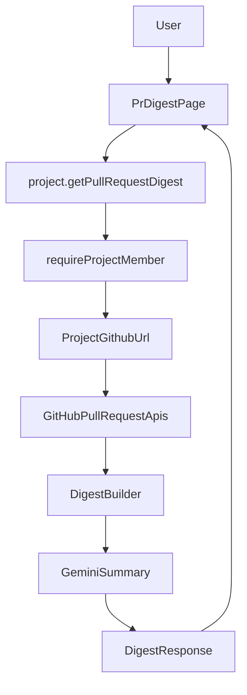

# PR / Review Digests

This document defines the recommended first version of the roadmap item in `feature.md`:

> AI summary of open PRs, risk areas, and "what changed since last week."

## Recommended V1

Build this as an **on-demand in-app digest** with a **rolling 7-day window**.

Why this is the best first version:

- It fits the current product shape: Gitwork already has project-scoped dashboards, commit summaries, Q&A, and meetings.
- It avoids scheduling, email, Slack, and notification complexity in v1.
- It uses the existing GitHub + Gemini stack already present in the app.
- It gives immediate value while keeping the implementation reviewable.

## User Story

As a project member, I want to open a PR digest for my repo and quickly understand:

- which PRs are open
- what changed recently
- where review risk is concentrated
- what is new since the last 7 days

## What V1 Should Do

For a selected project, generate a digest that includes:

1. **Open PR overview**
   - PR title
   - author
   - created/updated time
   - draft vs ready-for-review
   - additions, deletions, changed files

2. **AI summary per PR**
   - what the PR is trying to do
   - key files or areas touched
   - likely reviewer focus points

3. **Risk area callouts**
   - large diff size
   - many files changed
   - infra / auth / billing / database / API / permissions hotspots
   - low description quality or missing context

4. **"Changed since last week" section**
   - PRs opened in the last 7 days
   - PRs merged in the last 7 days
   - PRs with meaningful activity in the last 7 days
   - top themes from those changes

5. **Digest-level summary**
   - short executive summary
   - biggest risks
   - what deserves review attention first

## What V1 Should Not Do

Keep these out of the first version:

- scheduled digests
- email or Slack delivery
- per-reviewer assignment logic
- code owner enforcement
- line-by-line review comments
- persistent digest history

Those can come in later once the on-demand flow proves useful.

## Requirements

### Product requirements

- The digest must be project-scoped.
- Only project members can generate and view it.
- The digest should be generated on demand from live GitHub data.
- The UI should clearly separate:
  - open PRs
  - merged/recent activity
  - AI risk summary
- Users should be able to refresh/regenerate the digest.

### Data requirements

For each repo, the app needs GitHub access to:

- list open pull requests
- get PR metadata
- get changed files per PR
- get review state if available
- list recently merged PRs or recent PR activity

Recommended GitHub token scope for this feature:

- fine-grained PAT
- repository access to selected repos
- pull requests read access
- contents read access
- metadata read access

If review metadata is included later, the token may also need review-related read access depending on GitHub's permission model.

### AI requirements

The summarizer needs:

- PR title and body
- changed file list
- diff patches or a reduced patch summary
- optional review/comment metadata

The prompt should produce structured output:

- summary
- risk areas
- reviewer checklist
- "what changed since last week" themes

## Suggested UX

Add a new page in the protected app navigation:

- `PR Digests`

Suggested first-page layout:

1. Header
   - title
   - rolling 7-day label
   - `Generate digest` button

2. Executive summary card
   - repo-wide AI summary

3. Risk highlights card
   - top risky PRs
   - why they are risky

4. Open PR list
   - one card per PR
   - metadata + AI summary + files changed count

5. Changed in last 7 days
   - opened
   - merged
   - active / updated

## Technical approach

### Existing code to reuse

- GitHub API client in [src/lib/github.ts](src/lib/github.ts)
- project membership checks in [src/server/api/project-access.ts](src/server/api/project-access.ts)
- protected project router in [src/server/api/routers/project.ts](src/server/api/routers/project.ts)
- existing AI summary pattern from commit summaries in [src/lib/github.ts](src/lib/github.ts)

### Recommended implementation shape

1. Add PR-fetching helpers in `src/lib/github.ts` or a new `src/lib/github-prs.ts`
2. Add a protected tRPC procedure such as:
   - `project.getPullRequestDigest`
3. Fetch live GitHub PR data for the selected project repo
4. Normalize the GitHub response into digest inputs
5. Run Gemini once for:
   - repo-wide digest summary
   - per-PR summary/risk notes
6. Render a new protected page:
   - `src/app/(protected)/pr-digests/page.tsx`

## Data flow



## API shape for V1

Recommended response shape:

```ts
type PullRequestDigest = {
  generatedAt: string;
  projectId: string;
  window: "rolling_7_days";
  executiveSummary: string;
  riskHighlights: Array<{
    prNumber: number;
    title: string;
    riskLevel: "low" | "medium" | "high";
    reasons: string[];
  }>;
  openPullRequests: Array<{
    number: number;
    title: string;
    author: string;
    url: string;
    isDraft: boolean;
    state: "open";
    createdAt: string;
    updatedAt: string;
    additions: number;
    deletions: number;
    changedFiles: number;
    summary: string;
    reviewerFocus: string[];
    riskAreas: string[];
  }>;
  changedSinceLastWeek: {
    opened: number;
    merged: number;
    active: number;
    themes: string[];
  };
};
```

## Rollout plan

### Phase 1

- On-demand generation only
- No DB persistence
- One repo-wide summary + per-PR summaries
- Rolling 7-day comparison

### Phase 2

- Save digest history
- Compare current digest to previous digest
- Add merged PR trend summaries

### Phase 3

- Slack/email delivery
- scheduled weekly digests
- team-facing notification workflows

## Open questions for later

- Should digest generation be owner-only or available to any member?
- Should recent merged PRs include closed-but-unmerged PRs?
- Should review comments be included in risk scoring?
- Should the app cache a digest for a few minutes to reduce token cost?

## Final recommendation

Ship **on-demand PR digests in the app** first.

That gives Gitwork a natural extension of the current commit-summary experience, keeps requirements small, and creates a clean foundation for later scheduled or team-delivered digests.
